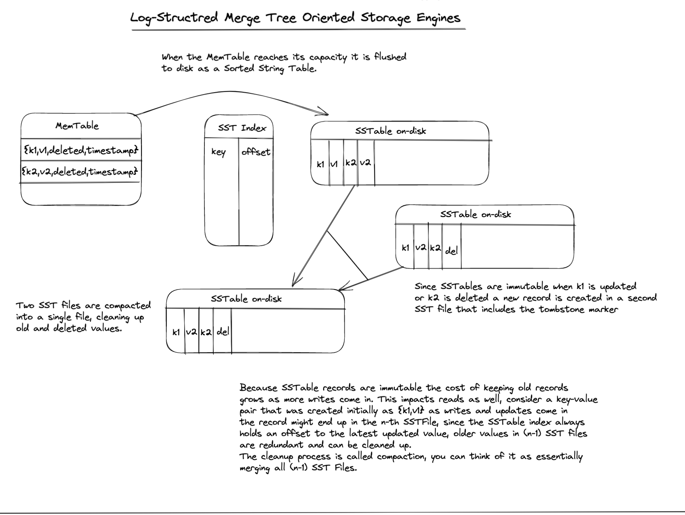

# Architecture of an LSM storage engine

## MemTables, SSTables and the LSM Tree structure

* Writes are done in-memory to the MemTable (various implementations) once a MemTable reaches
its capacity the table is flushed to disk. The MemTable is cleared and an SST index is created
that maps keys to their offset in the most recent SST File.

* Reads check the MemTable first, if a key is not found we check the SST index then read
the key value pair from the SST file using the offset stored in the SST index.

* The SST index always has the most recent version of a key, so if a key-value pair is created
then updated twice then deleted, we'll have four versions of the key in different SST files.
But the index always keeps the most recent version.

* SST Files are immutable, so to clean up older versions for a key value pair a process known
as compaction is periodically run in the background. Compaction processes existing SST files
merging them into a new one. 

* Various higher level optimizations can be used (caches and bloom filters) to improve
read performance.

* Because SSTables are sorted the SST index can be sparse O(log(n)) instead of O(n).
Consider an example {handbag,8786}, {handcuffs,2729}, {handful,4456},{handiwork,43232},{handkerchief,958334}
We can keep an index of {handbag, offset},{handful, offset},{handkerchief,offset}.
Seeking {handcuffs} will not yield a result in the index, but we know our index has {handbag} and {handful}
and {handcuffs} is in-between (SST files are sorted !).